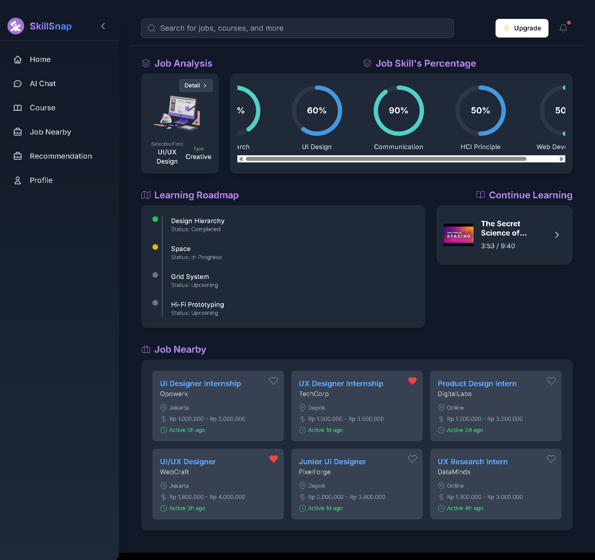
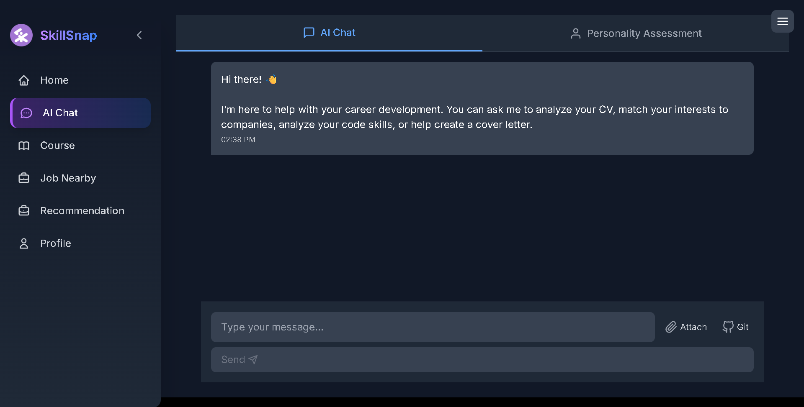
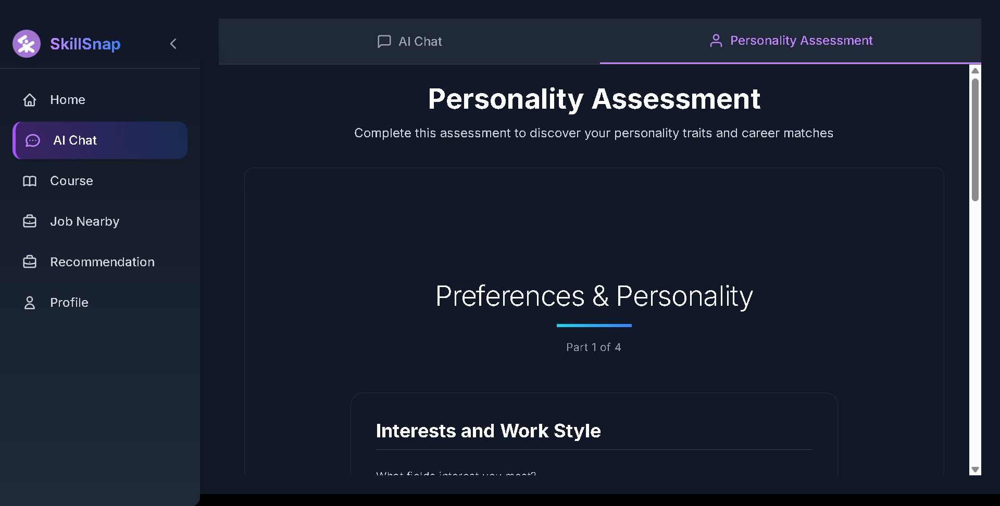
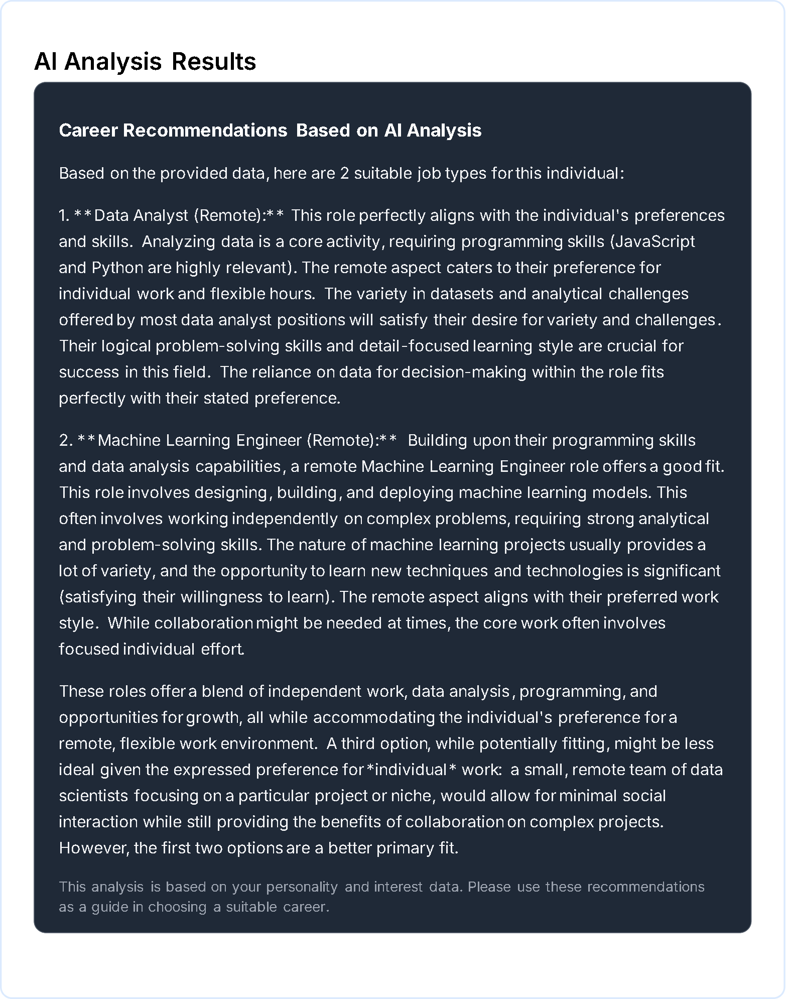
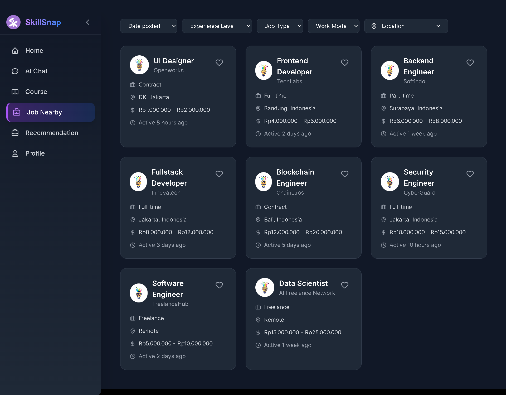
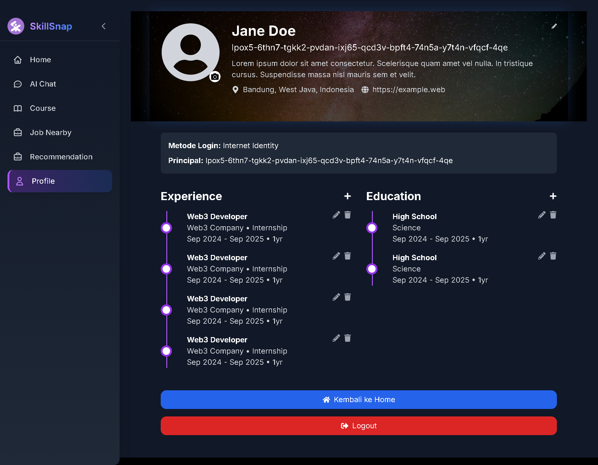
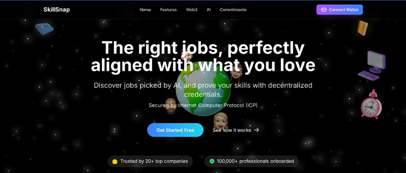
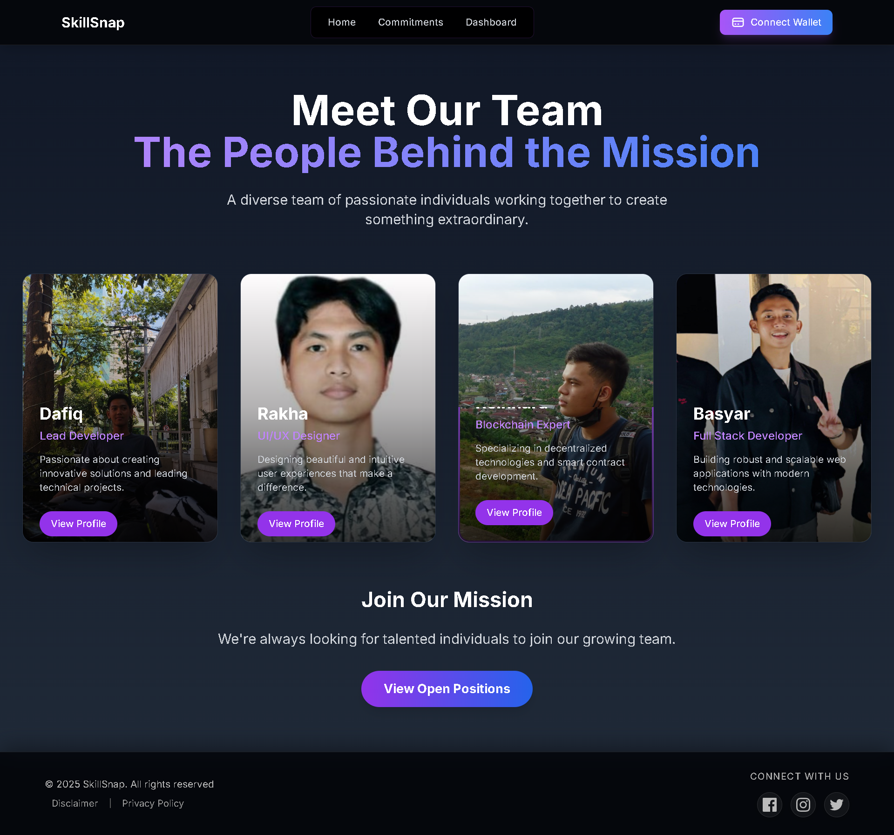

# 🚀 Skillsnap: Skill Intelligence Engine with Interest-Based Matching & Wallet Sync

Skillsnap is a comprehensive Web3 platform that integrates a career intelligence engine, an online learning portal, and a job marketplace into a single, cohesive ecosystem. Our core mission is to bridge the skills gap and solve the problem of job mismatch by providing a personalized, verifiable, and secure path from learning to employment. By leveraging AI to understand individual potential and Web3 to verify skills, Skillsnap empowers users to find a career they love while providing companies with a pipeline of pre-vetted, qualified talent.
---

### Dashboard Page



The dashboard provides an overview of the platform, allowing users to quickly access key features and track their activities.

### Analysis Certificate Course with AI Chat



This feature enables users to analyze certificate courses using an interactive AI-powered chat assistant for deeper insights.

### Work Recommendation with AI



Users can input their skills and preferences into the AI form to receive tailored work recommendations.



Shows the work recommendations provided by AI. The results can be downloaded in jpg format so that they can be easily viewed again if forgotten.

### Job Recommendation Realtion



This section displays a list of job recommendations, helping users explore relevant opportunities based on their profile.

### Profile Page



The profile page allows users to manage their personal information, track progress, and customize their experience.

### Home Page


The SkillSnap homepage introduces the platform as an innovative AI and Web3-based solution that helps users find jobs that match their interests and verify their skills through secure and reliable decentralized certificates. The first page can be scrolled to learn more about the platform.

### Commitments Page


This page showcases SkillSnap's long-term commitment to shaping a more equitable, open, and technology-driven future for careers.

---

## �🛠️ Complete Resources

- Basic Documentation : [Go To File](https://drive.google.com/file/d/1WMWw51RaSzWJEMexqw_rmEcyA8eMpuaZ/view?usp=sharing) 
- Pitch Deck : [Go To File](https://drive.google.com/file/d/19g_9K4jlUA9tzT1ZZM5zDl4XuXW7cQH1/view?usp=sharing)
- Video Demo : [Go To Video](https://drive.google.com/file/d/1NSzQQplC1hyz__ct9LaCAo78e2gzpfBN/view?usp=drive_link)
- Mainnet: https://iem4x-7yaaa-aaaap-qqdxq-cai.icp0.io/

---

## Features of Skillsnap
  1. Job Recommendation
     - High personalization: Job recommendations are tailored to the user’s profile, interests, and skills.
     - Time efficiency: Reduces the need to manually search for job listings.
     - Skill-based relevance: Focuses on matching skills rather than just education or work experience.
  3. Certificate and Skill Validation
     - Enhanced credibility: Proves the authenticity of users’ certificates and skills.
     - Data security: Certificates are digitally validated, reducing the risk of forgery.
     - Employer trust: Recruiters gain more confidence in the applicant’s qualifications.

## 🛠️ Requirements (for local development)

- [Docker](https://www.docker.com/) is already installed
- The project folder has been cloned from this repository
- If you are using Windows, we recommend using Windows PowerShell or Git Bash.
- DFINITY SDK (dfx) is already installed.
- Ports **3000** (for the frontend) and **4943** (for DFX) are not currently in use

---

## 🧱 1. Run with Docker

Go to the cloned folder and run the following command to build the container:

```bash
docker-compose up --build -d

docker container exec -it icp-dev-env /bin/bash
```

If you are using Linux OS, you can run the above command directly, whereas if you are using Docker Desktop, you must first open it and enter the terminal from Docker.

---

## ⚙️ 3. Configuration

Copy the `.env.example` file to `.env` and fill it in as needed:

```bash
cp .env.example .env
```

go to the gemini proxy configuration folder.

```bash
cd src/skillsnap_frontend/src/AI/
```

Copy the `.env.gemini.example` file to `.env.gemini` and fill it in as needed:

```bash
cp .env.gemini.example .env.gemini
```

Open and edit the .env.gemini file by adding the gemini token.

---

## 🔧 4. Running Locally with DFX

Place the directory into the project folder:

```bash
cd /root/app

npm install

dfx start --background --host 0.0.0.0:4943

dfx deploy

dfx generate
```

---

## 📁 6. Frontend

Frontend setup configuration:

```bash
cd src/skillsnap_frontend

npm install

npm run build

npm run start
```

---

## 🐍 13. AI Proxy

AI Proxy with python setup configuration:

```bash
cd /src/skillsnap_frontend/

apt-get update

apt install python3.11-venv

python3 -m venv venv

source venv/bin/activate

cd src/AI/

pip install -r requirements.txt

python gemini_proxy.py
```

---

## 🔄 16. Deployment to Mainnet (ICP)

```bash
dfx deploy --network ic
```
