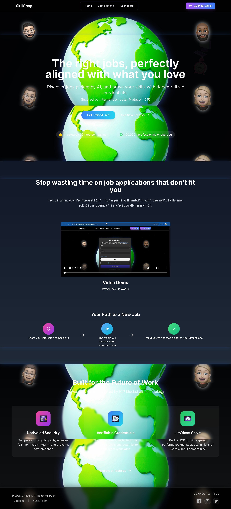

# 🚀 Internet Computer Project Guide + Frontend Containerized

This project consists of a **Motoko** backend and a **React** frontend, running inside a **Docker** container. This guide helps you build, log in, and run the entire system locally using `dfx` inside a container via Docker Desktop.

---


### Home Page



The SkillSnap homepage introduces the platform as an innovative AI and Web3-based solution that helps users find jobs that match their interests and verify their skills through secure and reliable decentralized certificates. The first page can be scrolled to learn more about the platform.

### Features Page


This page will be the hub for SkillSnap's advanced features, which aim to expand the platform's functionality in supporting Web3 and artificial intelligence-based career development.

### Web3 Page


This page highlights SkillSnap's commitment to providing a transparent, secure, and decentralized skill validation system through the integration of Web3 technology.

### AI Page


This page is designed to collect personal information and user preferences through a survey form processed by AI to generate the most suitable career recommendations. Through strategic questions about work style, interests, personality, and professional goals, the SkillSnap AI system will analyze user responses and present relevant, personalized, and data-driven job options.


Shows the work recommendations provided by AI. The results can be downloaded in jpg format so that they can be easily viewed again if forgotten.

### Commitments Page


This page showcases SkillSnap's long-term commitment to shaping a more equitable, open, and technology-driven future for careers.

---

## �🛠️ Complete Resources

- Basic Documentation : https://drive.google.com/drive/folders/1y3KtvmFWUei_SZQ3RYBmHrDNe6mz8_Dj
- Pitch Deck : https://drive.google.com/drive/folders/1GC1exH2SivdmdTGboEZH6waDzLq_xmt7
- Demo Video : https://drive.google.com/drive/folders/1V_R0owWebW1_WZ7VQ_DfHG4B4am8wMS0
- Frontend (UI): https://iem4x-7yaaa-aaaap-qqdxq-cai.icp0.io/
- Backend (Candid Interface): https://a4gq6-oaaaa-aaaab-qaa4q-cai.raw.icp0.io/?id=idn2d-saaaa-aaaap-qqdxa-cai

---

## 🛠️ Requirements (for local development)

- [Docker](https://www.docker.com/) is already installed
- The project folder has been cloned from this repository
- If you are using Windows, we recommend using Windows PowerShell or Git Bash.
- DFINITY SDK (dfx) is already installed.
- Ports **3000** (for the frontend) and **4943** (for DFX) are not currently in use

---

## 🧱 1. Run with Docker

Go to the cloned folder and run the following command to build the container:

```bash
docker-compose up --build -d

docker container exec -it icp-dev-env /bin/bash
```

If you are using Linux OS, you can run the above command directly, whereas if you are using Docker Desktop, you must first open it and enter the terminal from Docker.

---

## ⚙️ 3. Configuration

Copy the `.env.example` file to `.env` and fill it in as needed:

```bash
cp .env.example .env
```

go to the gemini proxy configuration folder.

```bash
cd src/skillsnap_frontend/src/AI/
```

Copy the `.env.gemini.example` file to `.env.gemini` and fill it in as needed:

```bash
cp .env.gemini.example .env.gemini
```

Open and edit the .env.gemini file by adding the gemini token.

---

## 🔧 4. Running Locally with DFX

Place the directory into the project folder:

```bash
cd /root/app

npm install

dfx start --background --host 0.0.0.0:4943

dfx deploy

dfx generate
```

---

## 📁 6. Frontend

Frontend setup configuration:

```bash
cd src/skillsnap_frontend

npm install

npm run build

npm run start
```

---

## 🐍 13. AI Proxy

AI Proxy with python setup configuration:

```bash
cd /src/skillsnap_frontend/

apt-get update

apt install python3.11-venv

python3 -m venv venv

source venv/bin/activate

cd src/AI/

pip install -r requirements.txt

python gemini_proxy.py
```

---

## 🔄 16. Deployment to Mainnet (ICP)

```bash
dfx deploy --network ic
```
